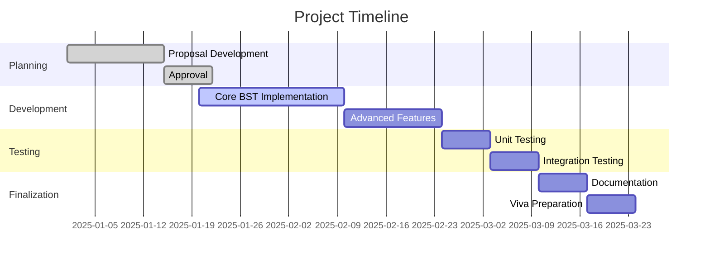

<div align="center">

# 🎓 Smart Student Result Management System

### *Powered by Binary Search Tree (BST) Technology*


*An intelligent academic management solution demonstrating the power of data structures in real-world applications*

[Features](#-key-features) • [Getting Started](#-getting-started) • [Documentation](#-documentation) • [Contributors](#-contributors)

---

</div>

## 📖 Overview

The **Smart Student Result Management System** represents a cutting-edge academic software solution developed as part of the **Principles of Data Structures and Algorithms (PDSA)** coursework. This system harnesses the efficiency of **Binary Search Trees** to revolutionize how academic institutions manage, analyze, and retrieve student performance data.

By implementing advanced BST operations—insertion, searching, deletion, and traversal—this project bridges theoretical computer science concepts with practical educational technology needs.

---

## 🎯 Project Objectives

<table>
<tr>
<td width="50%">

### 🏗️ Technical Goals
- Implement a robust **Binary Search Tree** architecture
- Achieve **O(log n) search complexity** for result retrieval
- Demonstrate efficient data structure operations
- Apply theoretical PDSA concepts practically

</td>
<td width="50%">

### 📊 Functional Goals
- Maintain **automatically sorted** student records
- Enable **lightning-fast** index-based searches
- Generate comprehensive performance analytics
- Support academic decision-making processes

</td>
</tr>
</table>

---

## 🧠 Why Binary Search Tree?

The **Binary Search Tree** was selected as the core data structure for compelling reasons:

```
Performance Benefits:
├── ⚡ Fast Operations: O(log n) for insert, search, delete
├── 📑 Auto-Sorting: Maintains inherent order without extra processing
├── 🎯 Efficient Retrieval: Direct path to any student record
└── 📈 Scalability: Handles growing datasets gracefully
```

**BST Key:** Student Index Number (Unique Identifier)

---

## ✨ Key Features

### 🔧 Core Operations

| Feature | Description | Complexity |
|---------|-------------|------------|
| **➕ Add Records** | Insert new student results with automatic positioning | O(log n) |
| **🔍 Search Results** | Lightning-fast lookup by index number | O(log n) |
| **✏️ Update Marks** | Modify student performance data seamlessly | O(log n) |
| **🗑️ Delete Records** | Remove outdated entries while maintaining tree balance | O(log n) |
| **📋 Display All** | View complete sorted student database | O(n) |

### 🌟 Advanced & Novel Features

<div align="center">

| 🏆 Ranking System | ⚠️ Risk Detection | 🎓 Scholarship Finder | 📊 Analytics Engine |
|:-----------------:|:-----------------:|:---------------------:|:-------------------:|
| Auto-generate rank lists based on GPA/average marks | Identify struggling students needing intervention | Check eligibility for academic scholarships | Generate comprehensive performance reports |

</div>

---

## 🏛️ System Architecture

```
┌─────────────────────────────────────────────────────────┐
│          Smart Student Result Management System         │
└─────────────────────────────────────────────────────────┘
                              │
        ┌─────────────────────┼─────────────────────┐
        ▼                     ▼                     ▼
┌───────────────┐    ┌────────────────┐    ┌──────────────┐
│ Result Entry  │    │ BST Operations │    │ Search       │
│ Module        │    │ Module         │    │ Module       │
└───────────────┘    └────────────────┘    └──────────────┘
        │                     │                     │
        └─────────────────────┼─────────────────────┘
                              ▼
                    ┌──────────────────┐
                    │  Binary Search   │
                    │  Tree Core       │
                    └──────────────────┘
                              │
        ┌─────────────────────┼─────────────────────┐
        ▼                     ▼                     ▼
┌───────────────┐    ┌────────────────┐    ┌──────────────┐
│ Ranking &     │    │ Report         │    │ Performance  │
│ Analysis      │    │ Generation     │    │ Analytics    │
└───────────────┘    └────────────────┘    └──────────────┘
```

---

## 🛠️ Technology Stack

<div align="center">

| Category | Technology | Purpose |
|----------|-----------|---------|
| **💻 Language** | Java | Core development language |
| **🌲 Data Structure** | Binary Search Tree | Primary data organization |
| **🖥️ Interface** | Console / JavaFX | User interaction layer |
| **📦 Version Control** | Git & GitHub | Source code management |
| **🧪 Testing** | JUnit (Planned) | Quality assurance |

</div>

---

## 📂 Project Structure

```
Smart-Student-Result-Management-System/
│
├── 📁 src/
│   ├── 📄 Node.java                    # BST node implementation
│   ├── 📄 BinarySearchTree.java        # BST operations & logic
│   ├── 📄 Student.java                 # Student data model
│   ├── 📄 ResultManager.java           # Business logic layer
│   └── 📄 Main.java                    # Application entry point
│
├── 📁 docs/
│   ├── 📄 Proposal.pdf                 # Project proposal document
│   ├── 📄 SystemDesign.pdf             # Architecture diagrams
│   └── 📄 UserManual.pdf               # Usage guidelines
│
├── 📁 test/
│   └── 📄 BSTTest.java                 # Unit tests
│
├── 📄 README.md                         # This file
├── 📄 .gitignore                        # Git ignore rules
└── 📄 LICENSE                           # Academic use license

```

---

## ⚡ Performance Analysis

<div align="center">

### Time Complexity Comparison

| Operation | Linear Search | Binary Search Tree | Improvement |
|:---------:|:-------------:|:------------------:|:-----------:|
| **Insert** | O(n) | O(log n) | ✅ Exponential |
| **Search** | O(n) | O(log n) | ✅ Exponential |
| **Delete** | O(n) | O(log n) | ✅ Exponential |
| **Traverse** | O(n) | O(n) | ➖ Same |
| **Min/Max** | O(n) | O(log n) | ✅ Exponential |

</div>

### Space Complexity
- **Storage:** O(n) where n = number of students
- **Recursion Stack:** O(h) where h = tree height

---

## 🚀 Getting Started

### Prerequisites
```bash
☑️ Java Development Kit (JDK) 11 or higher
☑️ Git for version control
☑️ IDE (IntelliJ IDEA, Eclipse, or VS Code recommended)
```

### Installation

```bash
# Clone the repository
git clone https://github.com/kosaladathapththu/Smart-Student-Result-Management-System-using-Binary-Search-Tree-BST.git

# Navigate to project directory
cd Smart-Student-Result-Management-System-using-Binary-Search-Tree-BST

# Compile the project
javac src/*.java

# Run the application
java -cp src Main
```

---

## 💡 Usage Examples

### Adding a Student Record
```java
Student student = new Student("S001", "John Doe", 85.5, 90.0, 88.0);
bst.insert(student);
```

### Searching for Results
```java
Student result = bst.search("S001");
if (result != null) {
    System.out.println(result.getDetails());
}
```

### Generating Rank List
```java
List<Student> topPerformers = bst.getRankList(10); // Top 10 students
```

---

## 📚 Documentation

<div align="center">

| 📄 Document | Description | Status |
|------------|-------------|--------|
| **Project Proposal** | Initial project planning and objectives | ✅ Complete |
| **System Design** | Architecture and UML diagrams | ✅ Complete |
| **Source Code Docs** | Inline code documentation | 🟡 In Progress |
| **User Manual** | End-user guide | 🔵 Planned |
| **Viva Preparation** | Defense presentation notes | 🔵 Planned |

</div>

---

## 👥 Contributors

<div align="center">

<table>
<tr>
<td align="center">
<br />
<sub><b>Student Name 1</b></sub><br />
<sub>Lead Developer</sub><br />
📧 student1@email.com
</td>
<td align="center">
<br />
<sub><b>Student Name 2</b></sub><br />
<sub>Developer & Tester</sub><br />
📧 student2@email.com
</td>
</tr>
</table>

---

**Course:** Principles of Data Structures and Algorithms (PDSA)  
**Institution:** [Your Institute Name]  
**Academic Year:** 2025/2026  
**Supervisor:** [Lecturer Name]

</div>

---

## 📊 Project Status

<div align="center">



**Current Phase:** 🟡 Development In Progress (60% Complete)

</div>

---

## 🎓 Learning Outcomes

Through this project, students will master:

- ✅ Practical implementation of Binary Search Trees
- ✅ Time and space complexity analysis
- ✅ Object-oriented programming in Java
- ✅ Software development lifecycle management
- ✅ Problem-solving with appropriate data structures
- ✅ Academic software system design

---

## 📜 License

```
Copyright © 2025 [Your Names]

This project is developed for ACADEMIC PURPOSES ONLY as part of 
university coursework. It is not intended for commercial use.

All rights reserved under academic fair use policies.
```

---

## 🙏 Acknowledgements

We extend our sincere gratitude to:

- 👨‍🏫 **Course Lecturers** for their invaluable guidance and expertise
- 📚 **PDSA Course Team** for providing comprehensive learning materials
- 💻 **Open Source Community** for Java development resources
- 🤝 **Peer Reviewers** for constructive feedback and suggestions
- 🏛️ **[Your Institution]** for facilitating this learning opportunity

---

<div align="center">

### ⭐ If you find this project useful, please consider giving it a star!

**Made with ❤️ and ☕ by PDSA Students**

[](https://github.com/kosaladathapththu)
[](https://github.com/kosaladathapththu/Smart-Student-Result-Management-System-using-Binary-Search-Tree-BST)

---

*"The right data structure can make all the difference."*

</div>
